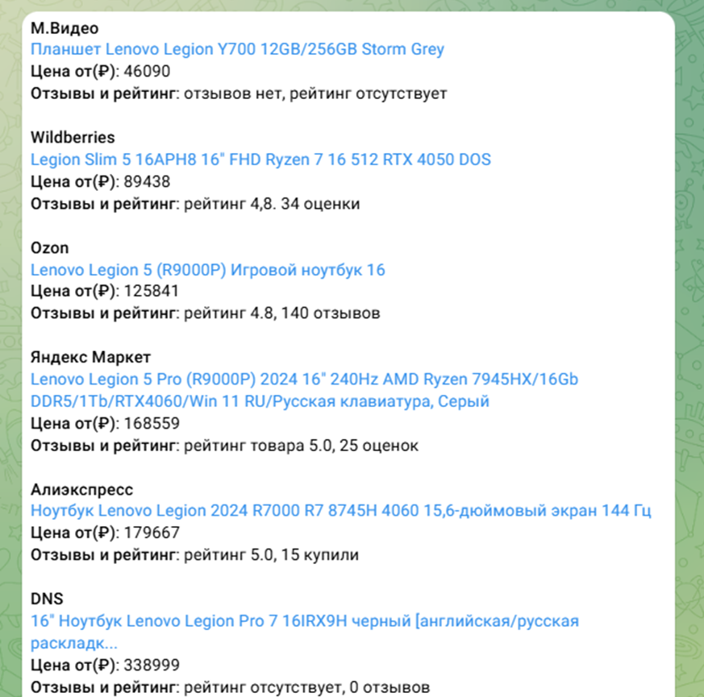

# Market-Analyzer-Bot
## Бот не размещен на хостинг!

# Скриншоты взаимодейстия
## Стартовое меню

## Вкладки

## Поиск товара

## Результат поиска

# Инструкция по запуску
## Получить токен через "BotFarther"

## Скачать репозиторий и встать токен в main 24 строчку

## Установить зависимости "pip install -r requirements.txt"
## Запустить бота из main.py